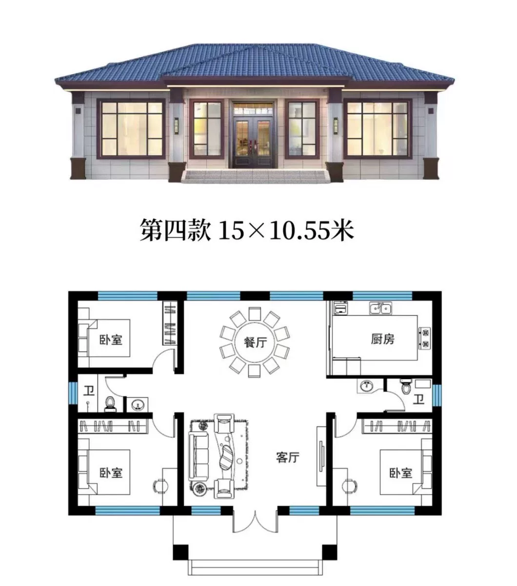
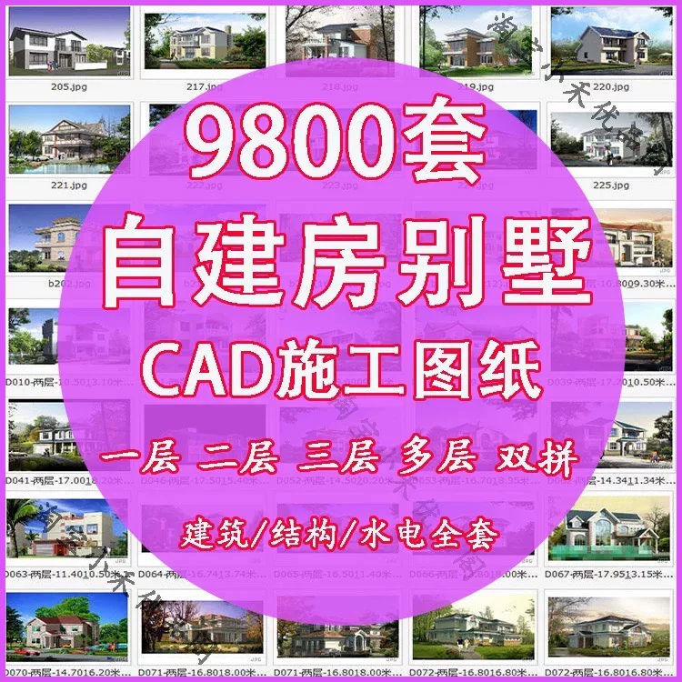
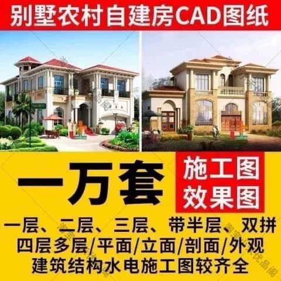
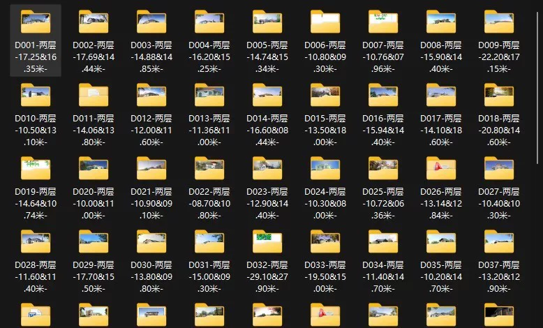
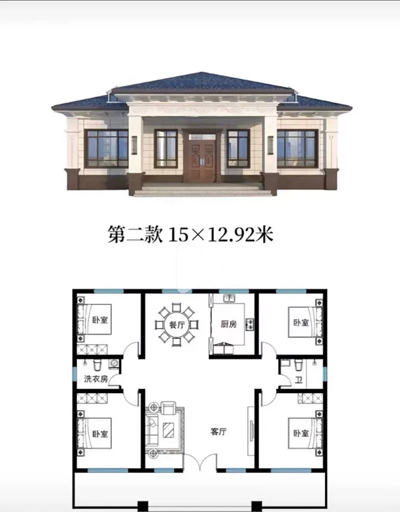
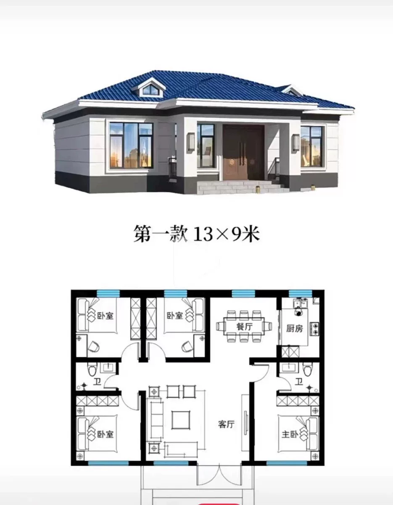
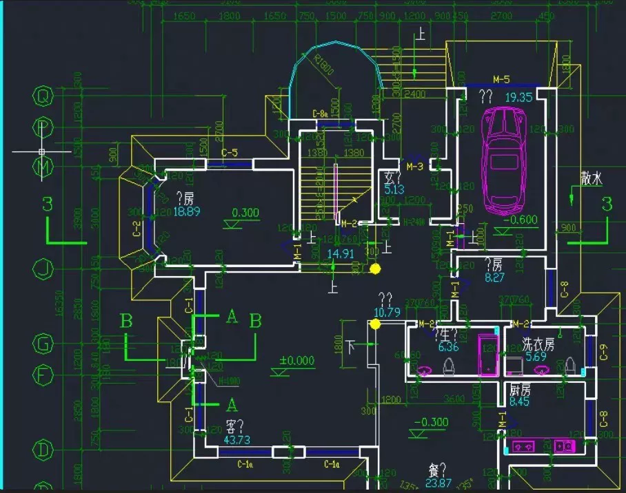

# Rural Self-Built House Design Drawings Include One-story Flat, Two-story Half-House and Three-story Villa, with an area of 120 square meters. Below is a brief description of the CAD construction drawings:

## Body

Rural Self-Built House Design Plan: One-story Flat, Two-story Half-House, Three-story Villa with 120 Sq.m CAD Construction Drawings

(Full product description was not available from the source page.)

## Images

## Payment

Here is a pay link on Stripe ( https://buy.stripe.com/3cs8yP7sY87d0vu9AB ). Please contact me lonlonago@foxmail.com after funding $89, and I will send you a complete data files , thank you!

